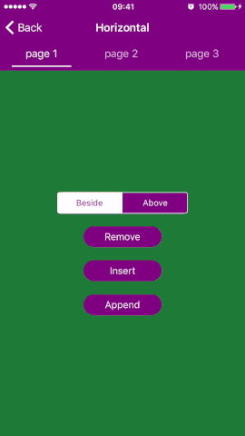
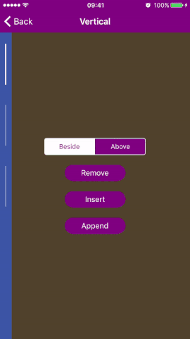

[](https://travis-ci.org/touchlane/SlideController)
[](https://codecov.io/gh/codecov/SlideController/branch/master)
[](http://cocoapods.org/pods/SlideController)
[](http://cocoapods.org/pods/SlideController)
[](http://cocoapods.org/pods/SlideController)

SlideController is simple and flexible UI component completely written in Swift. It is nice alternative for UIPageViewController built using power of generic types.




# Requirements

* iOS 9.0+
* Xcode 9.0+
* Swift 4.0+

# Installation

## CocoaPods

[CocoaPods](https://cocoapods.org) is a dependency manager for Cocoa projects. You can install it with the following command:

```$ gem install cocoapods```

To integrate SlideController into your Xcode project using CocoaPods, specify it in your ```Podfile```:

```ruby
source 'https://github.com/CocoaPods/Specs.git'
platform :ios, '10.0'
use_frameworks!

target '<Your Target Name>' do
    pod 'SlideController'
end
```

Then, run the following command:

```$ pod install```

# Usage

```swift
import SlideController
```

1) Create content
```swift
let content = [
            SlideLifeCycleObjectBuilder<PageLifeCycleObject>(),
            SlideLifeCycleObjectBuilder<PageLifeCycleObject>(),
            SlideLifeCycleObjectBuilder<PageLifeCycleObject>()
        ]
 ```
 
* ``PageLifeCycleObject`` is any object conforms to ``Initializable, Viewable, SlidePageLifeCycle `` protocols

2) Initialize SlideController
```swift
slideController = SlideController<CustomTitleView, CustomTitleItem>(
    pagesContent: content,
    startPageIndex: 0,
    slideDirection: .horizontal
)
```

* ``CustomTitleView`` is subclass of ``TitleScrollView<CustomTitleItem>``
* ``CustomTitleItem`` is subclass of ``UIView`` and conforms to ``Initializable, ItemViewable, Selectable`` protocols

3) Add ``slideController.view`` to view hierarchy

4) Call ``slideController.viewDidAppear()`` and ``slideController.viewDidDisappear()`` in appropriate UIViewController methods:

 ```swift
 override func viewDidAppear(_ animated: Bool) {
     super.viewDidAppear(animated)
     slideController.viewDidAppear()
 }
 ```
 
 ```swift
override func viewDidDisappear(_ animated: Bool) {
    super.viewDidDisappear(animated)
    slideController.viewDidDisappear()
}
```
